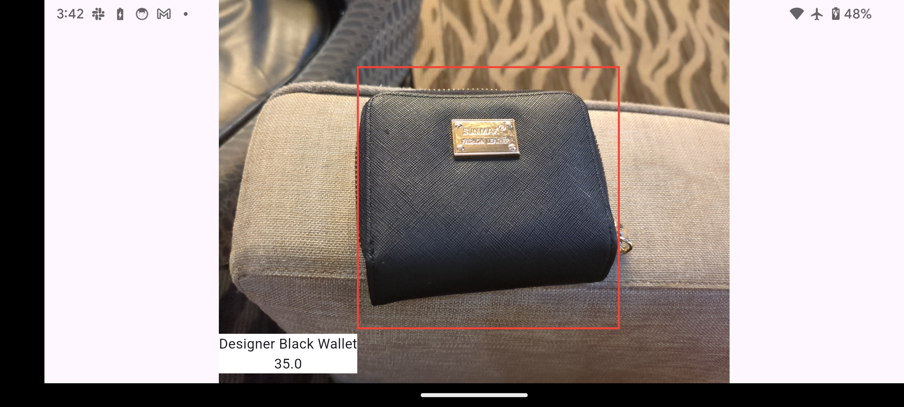
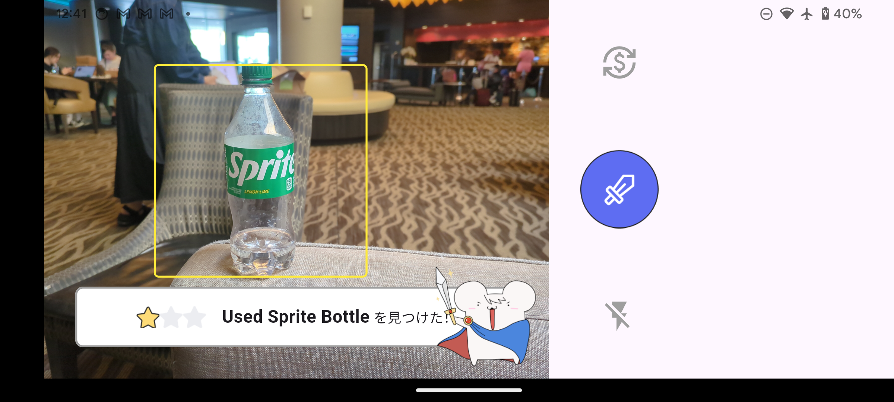

Backend For Mercari Bold Program
=

Backend for [Mercari Bold Program for Women: US Edition](https://about.mercari.com/press/news/articles/20240515_bold_program/)

## `/pose-estimate`
- Developed backend for [Super Meetup](https://github.com/ayumiohno/mercari_bold_meetup).
- Implemented a system to estimate poses (e.g., thumbs up, shoulder-to-shoulder) from photos using the following steps:
    1. Determined if individuals are giving a thumbs up using the CLIP model with customized thresholds.
    2. Identified shoulder-to-shoulder poses using the BLIP model.

## `/detection`
- Developed backend for [Mercari For Kids](https://github.com/aoi0108/new2_mercari_bold)
- Implemented an image-based estimation system to determine the main object category, segmentation, and price using the following steps:
    1. Estimated the main object category via OpenAI's API.
    2. Performed image segmentation using Detic (pre-trained VLM).
    3. Generated the item's title and estimated price from the cropped image using OpenAI's API.

